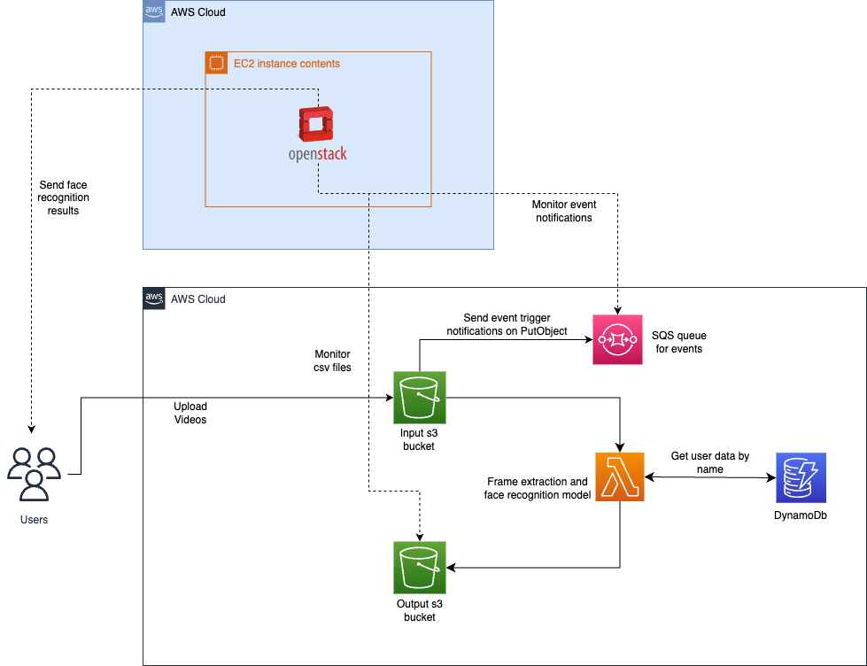

# Face Recognition using a PaaS-based application

## Group Members

- Prasidh Aggarwal (paggar10)
- Revanth (rbangal5)
- Shriya (ssrin103)

## Tasks

### Prasidh Aggarwal

Main responsibility was to setup the entire AWS infrastructure.

- Efficiently executed the tasks of setting up the project infrastructure.
- Created an AWS account and defined IAM users with appropriate permissions, ensuring secure access to the required resources.
- Configured user roles for the Lambda function, establishing the necessary privileges for seamless operation.
- Launched an EC2 instance to serve as the infrastructure for our OpenStack.
- Created a user role that the s3 bucket can assume, to be able to push event notifications into the SQS queue.
- Created the required JSON policies for the s3 buckets and the SQS queue.

### Shriya

Main responsibility was to write the script to trigger lambda from openstack.

- Wrote a python script that continuously polls the input SQS queue for incoming event notifications from the s3 bucket whenever a new video is added.
- Once the event is received, then processed it to retrieve the video information/name and then pass the required details to the lambda function and invoking it at the same time.
- Finally, added functionality to look for csv files corresponding to the uploaded videos in the output s3 bucket and print their respective outputs in the OpenStack console.

### Revanth

Main responsibility was to setup the entire OpenStack infrastructure.

- Handled the installation and setup of OpenStack with OVN using devstack.
- Configured the local.conf file with the right environment variables.
- Added a private subnet and the required routers for the correct network topology.
- Ran devstack to configure OpenStack.
- Installed the required libraries such as aws cli, boto3, python3.
- Troubleshooted any network errors/blockers during the setup of the OpenStack.

Apart from these individual tasks, every team member was involved in designing, implementing, developing, and testing the application.

## Architecture



## AWS Credentials

AWS credentials were used in the form of an access key to perform aws configure in the centos instance of openstack. Considering it is not a good practice to provide credentials on github, we won't be doing so.

## S3 Bucket Names

- serverlesspresso-input-us-west-1
- serverlesspresso-output-us-west-1

## Other AWS resources

- Lambda function --> face-recog-lambda-serverlesspresso
- Private ECR --> cse546-serverlesspresso
- Lambda user role --> face-recognition-lambda-role
- SQS queue name --> cse546-input-queue

## Project working and Architecture

Please click [here](./reports/ServerlessPresso_Group_Report.pdf) to read a detailed report of the working of the application.
For individual member reports use the below links:

- [Prasidh](./reports/Prasidh_Aggarwal_Individual_Report.pdf)
- [Shriya](./reports/Shriya_Srinivasan_Individual_Report.pdf)
- [Revanth](./reports/Revanth_Suresha_Individual_Report.pdf)

## How to get started?

1. Clone the repo.

2. In the handler.py modify the input and output bucket names if required.

3. Build the docker image using

   ```bash
   docker build -t <image-name> .
   ```

4. Login to the private ECR.

   ```bash
   aws ecr get-login-password --region us-west-1 | docker login --username AWS --password-stdin <ecr-url>
   ```

5. Tag the image to push to the ECR.

   ```bash
   docker tag <image-name> <ecr-url>/<ecr-name>:<image-tag>
   ```

6. Push the docker image to the ECR.

   ```bash
   docker push <ecr-url>/<ecr-name>:<image-tag>
   ```

7. SSH into the EC2 instance that is running openstack.

8. SSH into the CentOS instance and run the app.py script that will invoke the lambda by monitoring the S3 bucket.

9. From the workload generator directory, run the below command.

   ```bash
   python3 workload.py
   ```

10. Check the output bucket for the csv files with the student data.
